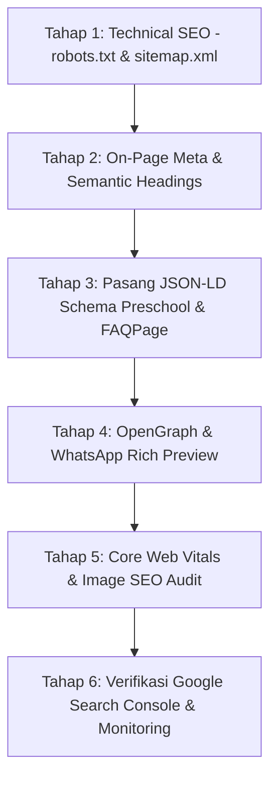

# 🚀 Master Plan Optimasi SEO (Search Engine Optimization)
## TK PAUD Permata Tigaraksa Tangerang

> **Tujuan Utama:** Menjadikan website **TK PAUD Permata Tigaraksa** berada di **Peringkat #1 Google** untuk pencarian sekolah PAUD & TK di wilayah Tigaraksa, Tangerang dan sekitarnya, serta meraih skor **Core Web Vitals 95+** di Google PageSpeed Insights.

---

## 📑 Daftar Isi
1. [Ringkasan Eksekutif & Target SEO](#1-ringkasan-eksekutif--target-seo)
2. [Audit & Analisis Kondisi SEO Saat Ini](#2-audit--analisis-kondisi-seo-saat-ini)
3. [Pilar 1: Strategi Kata Kunci (Keyword Research)](#3-pilar-1-strategi-kata-kunci-keyword-research)
4. [Pilar 2: Optimasi On-Page & Semantic HTML](#4-pilar-2-optimasi-on-page--semantic-html)
5. [Pilar 3: Technical SEO & Schema.org (JSON-LD)](#5-pilar-3-technical-seo--schemaorg-json-ld)
6. [Pilar 4: Local SEO & Google Maps Integration](#6-pilar-4-local-seo--google-maps-integration)
7. [Pilar 5: Optimasi Media, Kecepatan & Core Web Vitals](#7-pilar-5-optimasi-media-kecepatan--core-web-vitals)
8. [Pilar 6: Social Media Preview & Open Graph](#8-pilar-6-social-media-preview--open-graph)
9. [Roadmap & Checklist Implementasi Bertahap](#9-roadmap--checklist-implementasi-bertahap)

---

## 1. Ringkasan Eksekutif & Target SEO

### Target Pencarian & Metrik Kunci
| Metrik / Aspek | Kondisi Saat Ini | Target Capaian (Goals) |
| :--- | :--- | :--- |
| **Ranking Google Lokal** | Halaman 2–3 untuk kata kunci wilayah. | **Top 1–3 di Google** untuk kata kunci *"TK di Tigaraksa"*, *"PAUD Tigaraksa"*, *"TK Islami Tangerang"*. |
| **Google Search Console** | Terindeks sebagian. | **100% Halaman Terindeks** dengan Sitemaps & Rich Results valid. |
| **Rich Snippet Google** | Snippet standar polos. | **FAQ Accordion & Local Business Review Snippet** langsung tampil di halaman pencarian Google. |
| **Google PageSpeed** | Sedang. | **Skor 95+ (Mobile & Desktop)** dengan LCP < 1.8s & CLS 0. |
| **Tampilan Share WhatsApp** | Default preview. | **Rich Card Preview Ceria** dengan logo resmi, judul menarik, dan deskripsi singkat ramah ibu. |

---

## 2. Audit & Analisis Kondisi SEO Saat Ini

### Temuan Audit & Solusi:
1. **Robots.txt Belum Tersedia:**
   - *Temuan:* Mesin pencari (Googlebot, Bingbot) belum memiliki instruksi perayapan eksplisit.
   - *Solusi:* Buat file `robots.txt` dengan directive `Allow: /`, batasan file privat, dan link ke `sitemap.xml`.
2. **Sitemap Belum Menyeluruh:**
   - *Temuan:* `sitemap.xml` hanya mencantumkan halaman utama (`/`), belum menyertakan `html/mpls.html`.
   - *Solusi:* Perbarui `sitemap.xml` dengan tanggal modifikasi (`lastmod`), prioritas, dan halaman tambahan.
3. **Belum Ada Structured Data (JSON-LD Schema):**
   - *Temuan:* Google belum membaca entitas resmi sekolah secara semantik.
   - *Solusi:* Pasang skema JSON-LD `@type: Preschool`, `@type: EducationalOrganization`, dan `@type: FAQPage`.
4. **Optimasi Gambar & Video untuk Image/Video Search:**
   - *Temuan:* Gambar sudah dikompres ke `.avif` (sangat bagus), namun perlu penambahan atribut `alt` deskriptif berbasis kata kunci lokal dan eksplisit `width`/`height` untuk mencegah *Cumulative Layout Shift (CLS)*.

---

## 3. Pilar 1: Strategi Kata Kunci (Keyword Research)

### A. Kata Kunci Utama (High Intent / Local Search)
- `TK di Tigaraksa`
- `PAUD Tigaraksa Tangerang`
- `TK PAUD Permata Tigaraksa`
- `Sekolah TK Terbaik di Tigaraksa`
- `TK Islami Tigaraksa`

### B. Kata Kunci Pendaftaran & Biaya (High Conversion)
- `Pendaftaran TK Tigaraksa 2026`
- `Biaya Masuk TK Permata Tigaraksa`
- `PPDB TK PAUD Tigaraksa Tangerang`
- `SPP TK Murah Berkualitas Tangerang`

### C. Kata Kunci Program & Aktivitas (Informational Intent)
- `Kelompok Bermain Playgroup Tigaraksa`
- `Kegiatan Belajar Sambil Bermain TK`
- `Kurikulum PAUD Islami Tangerang`
- `Masa Pengenalan Lingkungan Sekolah TK`

---

## 4. Pilar 2: Optimasi On-Page & Semantic HTML

### A. Pola Heading Hierarchy yang Benar (H1, H2, H3)
- **H1 (Hanya 1 per Halaman):**  
  `<h1>TK PAUD Permata Tigaraksa Tangerang | Sekolah Ceria, Aman & Berkarakter Islami</h1>`
- **H2 (Setiap Section Utama):**  
  - `<h2>Kenapa Ayah & Bunda Memilih TK Permata Tigaraksa?</h2>`
  - `<h2>Program Belajar & Kategori Usia Anak (KB, TK A, TK B)</h2>`
  - `<h2>Bunda Pengajar Berdedikasi & Penuh Kasih Sayang</h2>`
  - `<h2>Fasilitas Tempat Belajar & Bermain Ramah Anak</h2>`
  - `<h2>Pertanyaan yang Sering Diajukan Bunda (FAQ PPDB)</h2>`
  - `<h2>Lokasi & Kontak Pendaftaran TK Permata</h2>`
- **H3 (Judul Kartu/Item):** Sub-fitur, nama guru, nama program, pertanyaan FAQ.

### B. Title Tag & Meta Description Berdaya Tarik Tinggi
```html
<!-- Primary Title Tag (50-60 Karakter) -->
<title>TK PAUD Permata Tigaraksa | Sekolah Ceria, Aman & Islami</title>

<!-- Meta Description (140-155 Karakter) -->
<meta 
  name="description" 
  content="TK PAUD Permata Tigaraksa Tangerang mendampingi si kecil tumbuh cerdas, mandiri & berakhlak mulia dengan metode bermain islami yang aman. Daftar PPDB 2026 sekarang!" 
/>
```

### C. Semantic HTML5 Tags
- Gunakan `<header>`, `<nav>`, `<main>`, `<section>`, `<article>`, `<aside>`, dan `<footer>` secara terstruktur agar bot mesin pencari dapat membaca hierarki konten dengan sempurna.

---

## 5. Pilar 3: Technical SEO & Schema.org (JSON-LD)

### A. Pembuatan File `robots.txt`
```txt
User-agent: *
Allow: /
Disallow: /scratch/
Disallow: /*.temp.mp4$

Sitemap: https://permatabelajar.my.id/sitemap.xml
```

### B. Pembaruan File `sitemap.xml`
```xml
<?xml version="1.0" encoding="UTF-8"?>
<urlset xmlns="http://www.sitemaps.org/schemas/sitemap/0.9">
  <url>
    <loc>https://permatabelajar.my.id/</loc>
    <lastmod>2026-09-19</lastmod>
    <changefreq>weekly</changefreq>
    <priority>1.0</priority>
  </url>
  <url>
    <loc>https://permatabelajar.my.id/html/mpls.html</loc>
    <lastmod>2026-09-19</lastmod>
    <changefreq>monthly</changefreq>
    <priority>0.8</priority>
  </url>
</urlset>
```

### C. Structured Data: Schema `@type: Preschool` & `LocalBusiness`
Menambahkan script JSON-LD di `<head>` agar Google menampilkan Knowledge Graph dan rating sekolah:
```html
<script type="application/ld+json">
{
  "@context": "https://schema.org",
  "@type": "Preschool",
  "name": "TK PAUD Permata Tigaraksa",
  "image": "https://permatabelajar.my.id/asset/img/general/logo.png",
  "@id": "https://permatabelajar.my.id",
  "url": "https://permatabelajar.my.id",
  "telephone": "+6285692590096",
  "email": "yayasanrayfi@gmail.com",
  "priceRange": "Rp",
  "address": {
    "@type": "PostalAddress",
    "streetAddress": "Desa Pete",
    "addressLocality": "Tigaraksa",
    "addressRegion": "Banten",
    "postalCode": "15720",
    "addressCountry": "ID"
  },
  "geo": {
    "@type": "GeoCoordinates",
    "latitude": -6.2547222,
    "longitude": 106.4549444
  },
  "openingHoursSpecification": {
    "@type": "OpeningHoursSpecification",
    "dayOfWeek": [
      "Monday",
      "Tuesday",
      "Wednesday",
      "Thursday",
      "Friday"
    ],
    "opens": "07:45",
    "closes": "10:20"
  },
  "founder": {
    "@type": "Person",
    "name": "Bu Siti Rohil, S.Pd"
  }
}
</script>
```

### D. Structured Data: Schema `FAQPage` (Google Rich Snippets)
Agar pertanyaan seputar biaya dan pendaftaran langsung tampil di hasil pencarian Google:
```html
<script type="application/ld+json">
{
  "@context": "https://schema.org",
  "@type": "FAQPage",
  "mainEntity": [
    {
      "@type": "Question",
      "name": "Berapa usia minimal untuk mendaftar di TK Permata?",
      "acceptedAnswer": {
        "@type": "Answer",
        "text": "Untuk Kelompok Bermain (Playgroup) usia mulai dari 2–4 tahun, sedangkan untuk TK Kelompok A dan B usia 4–6 tahun."
      }
    },
    {
      "@type": "Question",
      "name": "Berapa rincian biaya pendaftaran dan SPP bulanan?",
      "acceptedAnswer": {
        "@type": "Answer",
        "text": "Biaya awal masuk sangat terjangkau yaitu Rp 470.000 (sudah mencakup 3 set seragam lengkap, buku gambar, dan pensil warna) dengan SPP bulanan Rp 60.000."
      }
    }
  ]
}
</script>
```

---

## 6. Pilar 4: Local SEO & Google Maps Integration

1. **Konsistensi NAP (Name, Address, Phone Number):**
   - Nama: **TK PAUD Permata Tigaraksa**
   - Alamat: **Pete, Kec. Tigaraksa, Kabupaten Tangerang, Banten**
   - Telepon: **+62 856-9259-0096**
2. **Google Business Profile (Google Maps):**
   - Pastikan embed peta menggunakan koordinat presisi (`-6.2547222, 106.4549444`).
   - Tautkan link *"Lihat di Google Maps"* langsung ke profil resmi yayasan.
3. **Review & Testimoni Lokal:**
   - Tampilkan review bintang 5 dari para bunda yang mencantumkan nama wilayah (*"Wali Murid Tigaraksa"*).

---

## 7. Pilar 5: Optimasi Media, Kecepatan & Core Web Vitals

1. **Format Gambar Generasi Terbaru (AVIF/WebP):**
   - Seluruh gambar telah menggunakan format `.avif` yang berukuran 50–80% lebih kecil dibanding JPEG/PNG konvensional.
2. **Atribut `loading="lazy"` & `decoding="async"`:**
   - Semua gambar di bawah hero section dimuat secara bertahap saat digulir.
3. **Mencegah Cumulative Layout Shift (CLS):**
   - Tetapkan `aspect-ratio` atau dimensi eksplisit pada kontainer gambar dan video.
4. **Optimasi Font Loading:**
   - Gunakan `<link rel="preconnect" href="https://fonts.googleapis.com">` dan `font-display: swap` agar teks langsung muncul tanpa jeda putih (*Flash of Invisible Text*).

---

## 8. Pilar 6: Social Media Preview & Open Graph

Memastikan tampilan saat link website dibagikan di grup WhatsApp bunda, Facebook, maupun TikTok terlihat sangat menarik:

```html
<!-- Open Graph (Facebook, WhatsApp, LinkedIn) -->
<meta property="og:type" content="website" />
<meta property="og:url" content="https://permatabelajar.my.id/" />
<meta property="og:title" content="TK PAUD Permata Tigaraksa | Sekolah Ceria, Aman & Islami" />
<meta property="og:description" content="Tempat belajar & bermain terbaik untuk buah hati Anda di Tigaraksa Tangerang. Dibuka pendaftaran PPDB 2026/2027!" />
<meta property="og:image" content="https://permatabelajar.my.id/asset/img/general/logo.png" />
<meta property="og:image:width" content="512" />
<meta property="og:image:height" content="512" />

<!-- Twitter Card -->
<meta name="twitter:card" content="summary_large_image" />
<meta name="twitter:title" content="TK PAUD Permata Tigaraksa Tangerang" />
<meta name="twitter:description" content="Pendidikan anak usia dini yang ceria, aman, dan berkarakter Islami di Tigaraksa." />
<meta name="twitter:image" content="https://permatabelajar.my.id/asset/img/general/logo.png" />
```

---

## 9. Roadmap & Checklist Implementasi Bertahap



### Checklist Eksekusi:
- [x] **1. File Dasar:** Buat `robots.txt` dan perbarui `sitemap.xml`.
- [x] **2. Metadata Lengkap:** Pasang canonical URL, Title tag baru, dan meta description teroptimasi di `index.html` dan `html/mpls.html`.
- [x] **3. Structured Data:** Tambahkan script JSON-LD untuk `Preschool`, `EducationalOrganization`, `FAQPage`, dan `BreadcrumbList`.
- [x] **4. OpenGraph & Twitter:** Lengkapi tag `og:image`, `og:title`, `og:description`, dan `twitter:card`.
- [x] **5. Image Alt Keywords:** Pastikan seluruh tag `` memiliki atribut `alt` yang mengandung kata kunci deskriptif.
- [x] **6. Build & Minify:** Jalankan `npm run build:css` untuk memastikan CSS tetap terkompresi maksimal.

---
*Dokumen Master Plan SEO ini disusun untuk mendukung pertumbuhan dan eksistensi digital TK PAUD Permata Tigaraksa.*
